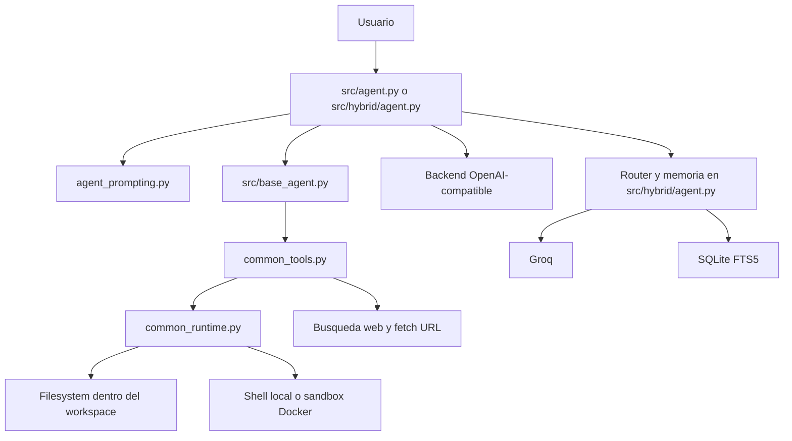

# Ollama Agent

Agente de codigo para backends OpenAI-compatible con dos variantes del mismo producto:

- `src/agent.py`: local-first, simple y rapido.
- `src/hybrid/agent.py`: local + cloud, critic mode, router y memoria.

La ruta canonica del producto hibrido ahora es `src/hybrid`. `IA/MEGA` queda solo como shim legado de transicion.
Los prompts base viven en `prompts/` y se renderizan en tiempo de ejecucion.

   

## Comparacion frontal

| Producto | Local | Offline | Tool calling | Multi-backend | Critic mode | AST scan | Safety sandbox | UI | Coste |
|---|---|---:|---:|---:|---:|---:|---|---|---|
| Ollama Agent | Si | Si en modo local | Si | Si | Si en `src/hybrid` | Si en `src/hybrid` | Parcial: blocklist + root guard | TUI | Bajo / 0 si usas Ollama |
| Aider | Si | Parcial | No nativo tipo function calling | Si | No | No | Parcial | CLI | API o local |
| OpenCode | Si | Depende del backend | Si | Si | No nativo | No | Parcial | CLI/TUI | Variable |
| Claude Code | No local real | No | Si | No | No publico | No publico | Fuerte, gestionada por proveedor | TUI | API/suscripcion |
| Codex CLI | No local real | No | Si | No | No publico | No publico | Fuerte, gestionada por proveedor | CLI | API |

`Safety sandbox` aqui significa lo que el producto expone por defecto al agente, no una comparativa formal de seguridad entre vendors.

## Variantes

### Local

`python src/agent.py`

- Backend OpenAI-compatible local o remoto.
- Modos `code`, `architect`, `research`.
- Tool calling para archivos, shell, web y navegacion de proyecto.

### Hybrid

`python src/hybrid/agent.py`

- Router entre backend local y Groq.
- Critic mode con segunda pasada local.
- AST scan del proyecto.
- Memoria persistente SQLite.
- Slash commands de sesion.

## Architecture



El flujo básico es: el usuario lanza una tarea, el agente construye el prompt, el modelo decide si necesita tools, `common_tools.py` ejecuta acciones dentro del workspace y el agente devuelve resultado o sigue iterando hasta cerrar la tarea.

## Instalacion

```bash
git clone https://github.com/DariodelBarrio/ollama-agent.git
cd ollama-agent
python scripts/install.py
python scripts/install.py --hybrid
```

Archivos de dependencias:

- `requirements.txt`
- `requirements-hybrid.txt`
- `requirements-mega.txt` es alias legado de compatibilidad

## Demo rapida en 60 segundos

```bash
git clone https://github.com/DariodelBarrio/ollama-agent.git
cd ollama-agent
python src/agent.py --model qwen2.5-coder:14b --dir .
```

Si quieres la variante hibrida:

```bash
python src/hybrid/agent.py --model qwen2.5-coder:14b --dir . --backend auto --critic
```

## Uso rapido

```bash
python src/agent.py --model qwen2.5-coder:14b --dir "C:\mi\proyecto"
python src/hybrid/agent.py --model qwen2.5-coder:14b --dir "C:\mi\proyecto" --backend auto --critic
```

Launchers Windows limpios:

- `src/hybrid/windows/local-coder.bat`
- `src/hybrid/windows/local-reasoner.bat`
- `src/hybrid/windows/critic.bat`
- `src/hybrid/windows/groq-cloud.bat`
- `src/hybrid/windows/install-deps.bat`

Launchers Unix equivalentes:

- `src/hybrid/unix/local-coder.sh`
- `src/hybrid/unix/local-reasoner.sh`
- `src/hybrid/unix/critic.sh`
- `src/hybrid/unix/groq-cloud.sh`
- `src/hybrid/unix/install-deps.sh`

## Ejemplos reales

### 1. Corregir un import roto

Input:

```text
Arregla el import roto en src/agent.py y verifica qué archivo lo define.
```

Tools:

```text
grep("build_system_prompt", path=".")
read_file("src/agent.py")
edit_file("src/agent.py", ...)
```

Resultado:

```text
El agente localiza la definición real, corrige el import y devuelve un diff resumido.
```

### 2. Revisar seguridad del runtime

Input:

```text
Revisa si run_command bloquea comandos destructivos y dime dónde está la política.
```

Tools:

```text
read_file("common_runtime.py")
grep("BLOCKED_COMMAND_PATTERNS", path=".")
read_file("tests/test_agent_safety.py")
```

Resultado:

```text
El agente identifica la blocklist, comprueba los tests de seguridad y resume qué queda cubierto y qué no.
```

### 3. Documentar una parte del sistema

Input:

```text
Explícame cómo decide el backend en el modo híbrido.
```

Tools:

```text
read_file("src/hybrid/agent.py")
grep("class SmartRouter", path="src/hybrid", extension=".py")
```

Resultado:

```text
El agente resume la heurística del router, cuándo fuerza Groq y cómo usa el umbral de contexto.
```

## Demos

- Flujo paso a paso: [docs/demo-flow.md](docs/demo-flow.md)
- Captura actual de la UI: [docs/screenshot.png](docs/screenshot.png)

El repo ya documenta el flujo `prompt -> accion -> diff -> resultado`. No he añadido un GIF nuevo al repo porque no habia una grabacion reproducible en esta maquina.

## Benchmark

- Benchmark y metodologia: [docs/benchmark.md](docs/benchmark.md)

El benchmark esta definido sobre 3 tareas y con formato reproducible. No se han inventado numeros donde no habia herramientas instaladas o ejecucion reproducible.

## Seguridad

Resumen:

- Las operaciones de fichero pasan por `resolve_in_root()`.
- Las rutas se resuelven con `Path.resolve()`, asi que los symlinks que escapan del root quedan bloqueados.
- Las rutas absolutas solo se permiten si, una vez resueltas, siguen dentro de `ROOT_DIR`.
- `change_directory()` no puede sacar al agente fuera del root del workspace.
- `run_command()` filtra una blocklist de comandos destructivos y pipelines peligrosos.
- Esto no es un sandbox de SO ni un contenedor. Es una capa de guardas de aplicacion.

Detalle completo: [docs/security.md](docs/security.md)

## Limitaciones actuales

- La sandbox es de aplicacion, no de sistema operativo. No sustituye un contenedor o una VM.
- La proteccion de shell usa blocklist; reduce riesgo, pero no demuestra seguridad completa.
- El benchmark frente a Aider/OpenCode esta definido, pero aun no incluye resultados cerrados y reproducibles para todas las herramientas.
- La demo visual esta documentada, pero el repo todavia no incluye un GIF/video corto definitivo.
- La variante `IA/MEGA` sigue existiendo como compatibilidad de transicion; la ruta canonica ya es `src/hybrid`.
- El producto sigue en fase temprana y la release inicial debe leerse como `v0.1.0`, no como API o UX estable.
- En Linux/macOS puede que necesites `chmod +x src/hybrid/unix/*.sh` antes del primer uso.

## Estructura

```text
ollama-agent/
├── src/
│   ├── agent.py
│   └── hybrid/
│       ├── __init__.py
│       ├── agent.py
│       └── windows/
│           ├── local-coder.bat
│           ├── local-reasoner.bat
│           ├── critic.bat
│           ├── groq-cloud.bat
│           └── install-deps.bat
├── common_runtime.py
├── common_tool_schemas.py
├── common_tools.py
├── docs/
├── prompts/
└── tests/
```

## Branding

Regla actual:

- `Ollama Agent` es el nombre del producto.
- `Local` y `Hybrid` son variantes.
- Se eliminan nombres de marketing mezclados como `MEGA`, `SONNET`, `OPUS` o `GEMINI` de la ruta principal y de los launchers canonicos.

## Tests

```bash
py -3 -m unittest discover -s tests -p "test_*.py"
```

## Licencia

MIT
