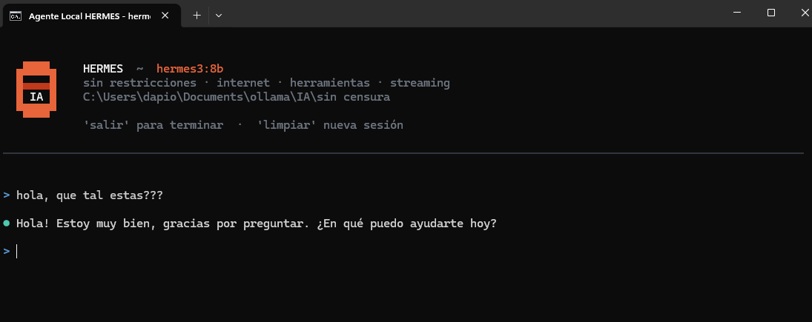

# 🧠 Ollama Agent — Agente de Programación Local

Agente autónomo de programación que corre **100% local** con [Ollama](https://ollama.com). Replica las capacidades principales de asistentes como Claude Code sin conexión a internet ni costos de API.

   



## Características

- **100% offline** — tu código nunca sale de tu equipo
- **Cero costos** — sin facturación por tokens
- **10 herramientas** — archivos, shell, web, grep, más
- **Modo agente** — encadena pasos sin interrumpir, nunca pide confirmación entre herramientas
- **Autocorrección** — si falla, analiza el error y reintenta hasta 3 veces con enfoque diferente
- **Streaming** — respuestas en tiempo real con Rich UI
- **Multi-modelo** — soporte para 7 modelos Ollama
- **GPU completa** — 100% CUDA en modelos 7b/8b, 32K contexto, mirostat v2

## Modelos Disponibles

| Tag | Modelo | Uso | GPU |
|-----|--------|-----|-----|
| **SONNET** | `qwen2.5-coder:7b` | Código rápido y preciso | 100% |
| **OPUS** | `deepseek-r1:14b` | Razonamiento profundo | ~74% |
| **DOLPHIN** | `dolphin3:8b` | Sin censura, rápido | 100% |
| **HERMES** | `hermes3:8b` | Sin censura, preciso | 100% |
| **GROQ** | `llama3-groq-tool-use:8b` | Tool calling optimizado | 100% |
| **DOLPHIN-HACKER** | `dolphin-hacker` | Pentesting, HTB | 100% |
| **HERMES-HACKER** | `hermes-hacker` | Pentesting, HTB | 100% |

## Herramientas

| Herramienta | Descripción |
|-------------|-------------|
| `run_command` | Ejecuta PowerShell/CMD |
| `read_file` | Lee archivos con números de línea |
| `write_file` | Crea archivos nuevos |
| `edit_file` | Edita texto exacto en archivos |
| `find_files` | Busca por patrón glob |
| `grep` | Busca texto/regex en el proyecto |
| `list_directory` | Lista carpetas |
| `delete_file` | Elimina archivos |
| `search_web` | DuckDuckGo para info actual |
| `fetch_url` | Descarga y lee URLs |

## Requisitos

- Python 3.9+
- [Ollama](https://ollama.com/download) instalado y corriendo
- NVIDIA GPU con CUDA (recomendado, pero funciona en CPU)
- Windows 10/11

## Instalación

```bash
# 1. Clonar repositorio
git clone https://github.com/DariodelBarrio/ollama-agent.git
cd ollama-agent

# 2. Instalar dependencias
pip install -r requirements.txt

# 3. Descargar modelos
cd IA\sin censura
DESCARGAR MODELOS.bat
```

## Uso

### Desde los accesos directos .bat

Abre cualquiera de los `.bat` en `IA/con censura/` o `IA/sin censura/`:

```
IA/
├── con censura/
│   ├── SONNET [qwen2.5-coder - Rapido y preciso].bat
│   └── OPUS [deepseek-r1 - Razonamiento profundo].bat
└── sin censura/
    ├── DOLPHIN [dolphin3 - Sin censura rapido].bat
    ├── HERMES [hermes3 - Sin censura preciso].bat
    ├── GROQ [llama3-groq-tool-use - Herramientas optimizado].bat
    ├── DOLPHIN-HACKER [HTB - Pentesting - Exploits].bat
    └── HERMES-HACKER [HTB - Pentesting - Exploits].bat
```

### Desde línea de comandos

```bash
# Modelo por defecto (qwen2.5-coder:7b)
python src/agent.py

# Modelo específico
python src/agent.py --model deepseek-r1:14b --dir "C:\mi\proyecto"

# Con nombre personalizado
python src/agent.py --model hermes3:8b --tag "MI-AGENTE"
```

### Comandos de sesión

| Comando | Acción |
|---------|--------|
| `salir` / `exit` / `quit` | Termina el agente |
| `limpiar` / `clear` / `reset` | Reinicia el historial |

## Configuración GPU

Variables de entorno (ya configuradas en los `.bat` y con `setx`):

```bash
set OLLAMA_NUM_GPU=999       # todas las capas en GPU
set OLLAMA_KEEP_ALIVE=-1     # modelo siempre cargado en VRAM
set CUDA_VISIBLE_DEVICES=0   # GPU primaria
```

Para configurarlas permanentemente en Windows:

```powershell
setx OLLAMA_NUM_GPU 999
setx OLLAMA_KEEP_ALIVE -1
setx CUDA_VISIBLE_DEVICES 0
```

Verificar que funciona:

```bash
ollama ps   # columna PROCESSOR debe mostrar 100% GPU (modelos 7b/8b)
```

## Parámetros de Modelo

Configuración optimizada para máxima inteligencia y precisión:

| Parámetro | Valor | Efecto |
|-----------|-------|--------|
| `mirostat` | 2 | Muestreo adaptativo — coherencia superior a top_p fijo |
| `mirostat_tau` | 5.0 | Entropía objetivo equilibrada para código |
| `temperature` | 0.15 | Preciso sin ser robótico |
| `num_ctx` | 32768 | Ventana de 32K tokens — proyectos grandes |
| `num_predict` | -1 | Sin límite de generación |
| `repeat_penalty` | 1.05 | Evita repeticiones sin cortar creatividad |

## Contexto de Proyecto

El agente carga automáticamente el primer archivo que encuentre:

1. `CLAUDE.md` — instrucciones para Claude Code
2. `README.md` — documentación del proyecto
3. `.cursorrules` — reglas del editor Cursor

## Documentación

La documentación técnica completa está en `docs/documentacion_agente_local.pdf`. Para regenerarla:

```bash
python scripts/generar_pdf.py
```

## Estructura del Proyecto

```
ollama/
├── src/
│   ├── agent.py                    # Agente principal
│   ├── Modelfile.dolphin-hacker    # Modelfile pentesting
│   └── Modelfile.hermes-hacker     # Modelfile pentesting
├── IA/
│   ├── con censura/                # Modelos estándar
│   └── sin censura/                # Modelos sin restricciones
├── scripts/
│   └── generar_pdf.py              # Generador de docs PDF
├── docs/
│   └── documentacion_agente_local.pdf
├── requirements.txt
├── .gitignore
└── README.md
```

## Dependencias

```
ollama
rich
duckduckgo-search
requests
beautifulsoup4
fpdf2
```

## Licencia

MIT
