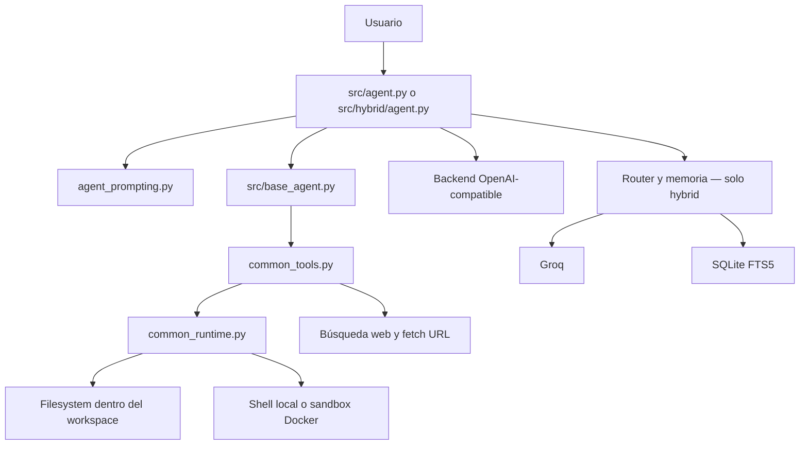

# Ollama Agent

Agente de código para backends OpenAI-compatible. Dos variantes del mismo núcleo:

- **Local** (`src/agent.py`): sin dependencias de nube, rápido, autocontenido.
- **Hybrid** (`src/hybrid/agent.py`): local + Groq, critic mode, router inteligente y memoria persistente.

   

> **Estado:** v0.1.0 — experimental. La API y la UX pueden cambiar sin aviso.

## Inicio rápido

**Requisitos previos:** [Ollama](https://ollama.com) instalado y corriendo, Python 3.9+.

```bash
git clone https://github.com/DariodelBarrio/ollama-agent.git
cd ollama-agent
python scripts/install.py
ollama pull qwen2.5-coder:14b
python src/agent.py --model qwen2.5-coder:14b --dir /ruta/al/proyecto
```

Para la variante híbrida (requiere `GROQ_API_KEY` si usas enrutamiento a Groq):

```bash
python scripts/install.py --hybrid

# Linux/macOS
export GROQ_API_KEY=gsk_...
chmod +x src/hybrid/unix/*.sh

# Windows
set GROQ_API_KEY=gsk_...

python src/hybrid/agent.py --model qwen2.5-coder:14b --dir /ruta/al/proyecto --backend auto
```

## Variantes

| Característica | Local | Hybrid |
|---|---|---|
| Backend | OpenAI-compatible (Ollama u otro) | Local + Groq (enrutamiento automático) |
| Modos | `code`, `architect`, `research` | idem + critic |
| Critic mode | No | Sí — segunda pasada con modelo local |
| AST scan | No | Sí — esqueleto Python/JS/TS |
| Memoria persistente | No | Sí — SQLite + FTS5 entre sesiones |
| Slash commands | `/help /clear /mode` | `/help /clear /switch /cost /critic /ast /plan /memory /compact` |
| Groq API key | No requerida | Solo si backend=auto o backend=groq |
| Dependencias extra | Ninguna | `requirements-hybrid.txt` |

## Instalación

```bash
python scripts/install.py           # variante local
python scripts/install.py --hybrid  # variante hybrid
```

Archivos de dependencias:

- `requirements.txt` — dependencias base (local agent)
- `requirements-hybrid.txt` — base + sglang, vllm

## Uso

### Local

```bash
python src/agent.py \
  --model qwen2.5-coder:14b \
  --dir /ruta/al/proyecto \
  [--ctx 8192] \
  [--temp 0.05] \
  [--api-base http://localhost:11434/v1]
```

### Hybrid

```bash
python src/hybrid/agent.py \
  --model qwen2.5-coder:14b \
  --dir /ruta/al/proyecto \
  --backend auto \
  [--critic]
```

Launchers preconfigurados disponibles en `src/hybrid/windows/` (`.bat`) y `src/hybrid/unix/` (`.sh`).

## Arquitectura



El usuario lanza una tarea → el agente construye el prompt → el modelo decide qué tools usar → `common_tools.py` ejecuta las acciones dentro del workspace → el agente itera hasta cerrar la tarea.

Los módulos compartidos (`common_runtime.py`, `common_tools.py`, `common_tool_schemas.py`, `agent_prompting.py`) están en la raíz y los consumen ambas variantes. `src/base_agent.py` centraliza UI, logger y wrappers de tools.

## Seguridad

El agente aplica guardas de aplicación, **no un sandbox de sistema operativo**:

- Las operaciones de fichero pasan por `resolve_in_root()`, que bloquea accesos fuera del workspace.
- Los symlinks se resuelven antes de evaluar el path, evitando escapes vía enlace simbólico.
- `run_command()` filtra una blocklist de comandos destructivos (`common_runtime.BLOCKED_COMMAND_PATTERNS`).
- `change_directory()` no puede sacar al agente fuera del `ROOT_DIR`.

Lo que **no** hace: no limita CPU/RAM/red, no inspecciona semántica completa del shell, no reemplaza un contenedor o VM.

Para trabajo con código sensible: usa un repo desechable, un usuario de pocos privilegios, o el sandbox Docker opcional (`src/sandbox.py`).

Detalle completo: [docs/security.md](docs/security.md)

## Estado del proyecto

- Versión `v0.1.0` — experimental, sin API pública estable.
- El benchmark frente a Aider/OpenCode está definido pero los resultados están pendientes ([docs/benchmark.md](docs/benchmark.md)).
- `IA/MEGA/` existe como shim de compatibilidad; la ruta canónica es `src/hybrid/`.

## Limitaciones

- **Sandbox de aplicación, no de OS.** La blocklist reduce riesgo pero no garantiza aislamiento completo.
- **Sin resultados de benchmark publicados.** Metodología definida; no se han publicado números no reproducibles.
- **API inestable.** La estructura de clases y argumentos puede cambiar entre versiones.
- **Groq requerida para routing externo.** Sin `GROQ_API_KEY`, el hybrid usa solo el backend local.
- **Memoria local.** La base SQLite es por máquina; no se sincroniza entre entornos.

## Ejemplos

### Corregir un import roto

```
Arregla el import roto en src/agent.py y verifica qué archivo lo define.
```

El agente busca con `grep`, lee el archivo, edita solo la línea necesaria y resume el cambio.

### Revisar cobertura de seguridad

```
Revisa si run_command bloquea comandos destructivos y dónde está la política.
```

El agente lee `common_runtime.py`, localiza `BLOCKED_COMMAND_PATTERNS`, revisa los tests y resume qué cubre y qué no.

### Entender el router híbrido

```
Explícame cómo decide el backend en el modo híbrido.
```

El agente lee `SmartRouter` en `src/hybrid/agent.py` y resume la heurística: umbral de contexto, patrones de tarea, forzado manual.

## Tests

```bash
python -m unittest discover -s tests -p "test_*.py"
```

CI corre en Python 3.11 y 3.12 sobre Windows. Ver [`.github/workflows/tests.yml`](.github/workflows/tests.yml).

## Estructura

```
ollama-agent/
├── src/
│   ├── agent.py              # variante local
│   ├── base_agent.py         # UI, logger y wrappers compartidos
│   ├── sandbox.py            # sandbox Docker opcional
│   └── hybrid/
│       ├── agent.py          # variante hybrid
│       ├── windows/          # launchers .bat
│       └── unix/             # launchers .sh
├── common_runtime.py         # seguridad: blocklist, resolve_in_root
├── common_tools.py           # tool runtime: ficheros, shell, web
├── common_tool_schemas.py    # validación Pydantic de argumentos de tools
├── agent_prompting.py        # carga y renderizado de prompts Jinja2
├── prompts/                  # templates del sistema
├── docs/                     # seguridad, benchmark, demo
└── tests/
```

## Licencia

MIT
